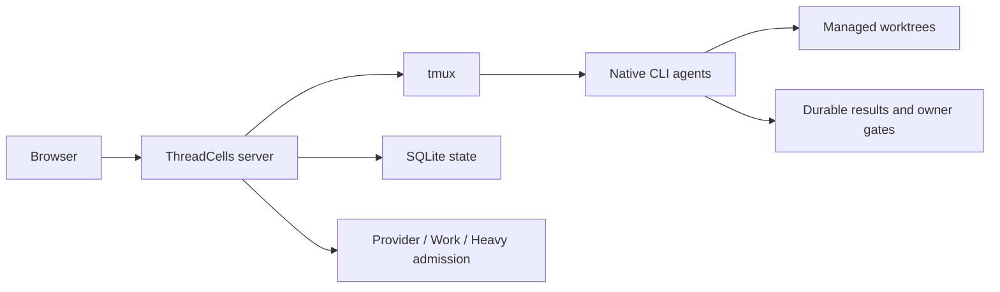

**[English](README.md)** · [Русский](README.ru.md) · [简体中文](README.zh-CN.md) · [Español](README.es.md) · [Português (Brasil)](README.pt-BR.md) · **Deutsch** · [日本語](README.ja.md)

# ThreadCells

**Betreibe Coding-Agenten als System, nicht als Haufen von Terminals.**

ThreadCells koordiniert native CLI-Coding-Agenten, hält offene Workflows über Modell-Turns hinweg in Bewegung und kümmert sich um die Orchestrierungsumgebung darunter. Es überwacht die Host-Auslastung, bereinigt sicher entbehrliche ThreadCells-Laufzeitartefakte und bewahrt aktive Arbeit sowie dauerhafte Historie auf deinem eigenen Linux-Host.

**[Website](https://iunknown404i.github.io/threadcells/de/)** ·
**[Dokumentation](https://iunknown404i.github.io/threadcells/de/docs/)** ·
**[GitHub](https://github.com/IUnknown404I/threadcells)** ·
**[Schnellstart](QUICK_SETUP.md)**

*Das reale Release-System im Betriebsmaßstab. Lokale Pfade, Ziele, Zugangsdaten und private Nachrichten sind aus öffentlichen Aufnahmen ausgeschlossen.*

## In 30 Sekunden

Erstelle eine Sitzung → wähle einen Agenten oder Supervisor → gib ihm die Aufgabe → beobachte den Workflow → greife nur ein, wenn ThreadCells eine Eigentümerentscheidung anfordert.

Ein Supervisor kann an Worker und Reviewer delegieren, Ergebnisse über den Inbox sammeln und dieselbe logische Mission über normale asynchrone Grenzen und Modell-Turns hinweg fortsetzen. Du musst keine Nachrichten zwischen Terminals kopieren oder die finale Antwort eines Providers als Missionsabschluss behandeln.

## Warum ThreadCells

- Agenten koordinieren sich unter dauerhaften Supervisor-Workflows, statt auf manuelles Kopieren und Einfügen angewiesen zu sein.
- Native CLI-Agenten bleiben in prüfbaren tmux-Terminals, mit verwalteten Worktrees und expliziter Schreibberechtigung.
- Host-Auslastung und unabhängige Kapazitätsgrenzen bleiben sichtbar, während das Schutzmengen-bewusste Housekeeping berechtigte Logs, Caches, Releases und abgeschlossene Laufzeitartefakte bereinigt.
- Aktive Arbeit, Live-Zustand, Wiederherstellungs-Releases, Backups und dauerhafte Sitzungs-, Workflow-, Inbox- und Ergebnishistorie sind vor der Routinebereinigung geschützt.
- Dauerhafte Ergebnisse und explizite Eigentümer-Gates bewahren die operative Wahrheit über Neustarts und die Stilllegung von Terminals hinweg.
- Optionale installationsweite Telegram-Benachrichtigungen melden Abschlüsse der obersten Ebene, Fehler und erforderliche Eigentümeraufmerksamkeit ohne projektspezifische Verkabelung.

ThreadCells hält seine eigene Agentenumgebung aktiv gesund; es kann nicht garantieren, dass der physische Host, Provider oder das Netzwerk niemals ausfällt. Unbekannter oder mehrdeutiger Zustand wird geschützt, statt als sicher löschbar zu vermuten.

| Dauerhafter Multi-Agent-Workflow | Geschütztes Housekeeping |
| --- | --- |
|  |  |

Telegram-Benachrichtigungen bieten einen geräuscharmen, installationsweiten Weg für Abschlüsse der obersten Ebene, Fehler und erforderliche Eigentümeraufmerksamkeit. Sensible Ziel- und Zugangsdatenfelder sind in [der öffentlichen Telegram-Aufnahme](launch-media/output/screenshots/threadcells-telegram.png) bewusst geschwärzt.

Beginne mit [Was ist ThreadCells?](docs/OVERVIEW.md), [Schnellstart](QUICK_SETUP.md) und [Dein erstes Projekt und dein erster Agent](docs/FIRST_AGENT.md). Der vollständige öffentliche Leitfaden behandelt [Installation](docs/INSTALLATION.md), [Kernkonzepte](docs/CONCEPTS.md), [Telegram-Benachrichtigungen](docs/TELEGRAM_NOTIFICATIONS.md), [Remotezugriff](docs/REMOTE_ACCESS.md), [Sicherheit](SECURITY.md) und [Betrieb](docs/OPERATIONS.md). Der integrierte Reader unter `/docs` stellt denselben paketierten, zugelassenen Dokumentationskorpus bereit.

Der [Quellcode der öffentlichen Website](website/README.md) baut statische Dateien für GitHub Pages oder anderes statisches Hosting. Provider- und Profilkonfiguration befinden sich unter `/settings/providers` und `/settings/profiles`; die Bereinigungsplanung unter `/settings/housekeeping`.

Für einen bewusst kleinen ersten Durchlauf nutze das [sichere Starterbeispiel](examples/threadcells-starter/README.md). Es gibt einem Supervisor, Entwickler und Reviewer eine begrenzte Dokumentationsaufgabe; die Agenten werden nicht gebeten, Zugangsdaten zu verwalten, zu veröffentlichen oder Dienste zu ändern.

## Sicherheits- und Preview-Status

Die technische Vorschau `0.2.0-alpha.1` unterstützt einen einzelnen Ubuntu/Debian-Linux-Host, Loopback-first-Zugriff und ein Codex-first-Setup. Native Agenten können mächtige Befehle ausführen; Worktrees sind keine Sicherheits-Sandbox. Siehe vor der Bewertung die [Einschränkungen](docs/LIMITATIONS.md).

Das öffentliche OCI-Paket `ghcr.io/iunknown404i/threadcells-release-bundle` enthält verifizierte Release-Archive und Nachweise. Es ist ein Distributionsartefakt, kein Docker-Image und kein unterstützter Container-Bereitstellungsmodus; siehe den [Release-Prozess](docs/RELEASE_PROCESS.md).

## FAQ

**Veröffentlicht oder exponiert ThreadCells während der Einrichtung etwas?** Nein. Das unterstützte Setup baut einen lokalen Kandidaten, verifiziert ihn und startet einen Listener nur auf Loopback, wenn du den Serverbefehl ausführst.

**Verändert `threadcells doctor` meinen Rechner?** Nein. Der Befehl meldet nur, ob die unterstützten lokalen Voraussetzungen vorhanden sind.

**Kann ich die UI remote aufrufen?** Ja, während ThreadCells nur auf Loopback lauscht. Nutze einen SSH-Tunnel für gelegentlichen Zugriff oder nach ausdrücklicher Genehmigung des Host-Eigentümers für die Zugriffsgrenze einen authentifizierten Caddy/Authelia-HTTPS-Proxy. Lege den rohen ThreadCells-Port niemals im öffentlichen Internet offen; siehe [Remotezugriff](docs/REMOTE_ACCESS.md).

**Kann ich die Web UI als App installieren?** Ja. Die Produktions-UI enthält ein grundlegendes PWA-Manifest und einen konservativen Service Worker. Sie bleibt netzwerkabhängig und cached niemals operative APIs, Autorisierung, Terminals, Workflows oder Statistics.

**Was sollte ich vor der Distribution prüfen?** Behandle Kandidatenmanifest, Prüfsummen, SBOM, Abhängigkeitsreview, Branding-Provenienz, Sicherheitsrichtlinie und Release-Nachweise als Review-Eingaben — nicht als Veröffentlichungsfreigabe.

## Issues & Mitwirken

Nutze [GitHub Discussions](https://github.com/IUnknown404I/threadcells/discussions) für Fragen, frühe Ideen und Community-Setups. Nutze den kuratierten Backlog in [GitHub Issues](https://github.com/IUnknown404I/threadcells/issues) für bestätigte, umsetzbare öffentliche Projektarbeit. Lies [CONTRIBUTING.md](CONTRIBUTING.md) für die schnellen Wege, [die kanonische Issue-Richtlinie](docs/ISSUES.md) für Eignung und Triage und [SECURITY.md](SECURITY.md) für die private Meldung von Schwachstellen.

## Maintainer

Erstellt und gepflegt von [Subaev Ruslan](https://github.com/IUnknown404I), mit Beiträgen der ThreadCells-Community.

## Provenienz

ThreadCells ist ein unabhängiger, inoffizieller Downstream des AWS Labs CLI Agent Orchestrator. Es wird nicht von Amazon Web Services gesponsert oder unterstützt. Die ursprüngliche Upstream-Arbeit ist unter der Apache License 2.0 lizenziert; siehe [NOTICE](NOTICE), [Provenienz](docs/PROVENANCE.md) und [Änderungen gegenüber Upstream](docs/CHANGES_FROM_UPSTREAM.md).
