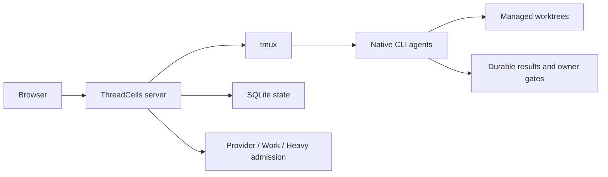

[English](README.md) · [Русский](README.ru.md) · [简体中文](README.zh-CN.md) · **Español** · [Português (Brasil)](README.pt-BR.md) · [Deutsch](README.de.md) · [日本語](README.ja.md)

# ThreadCells

**Ejecuta agentes de programación como un sistema, no como un montón de terminales.**

ThreadCells coordina agentes de programación CLI nativos, mantiene en marcha los flujos de trabajo abiertos entre turnos del modelo y cuida el entorno de orquestación que los sustenta. Supervisa la presión del host, recupera de forma segura los residuos desechables del runtime de ThreadCells y preserva el trabajo activo y el historial duradero en tu propio host Linux.

**[Sitio web](https://iunknown404i.github.io/threadcells/es/)** ·
**[Documentación](https://iunknown404i.github.io/threadcells/es/docs/)** ·
**[GitHub](https://github.com/IUnknown404I/threadcells)** ·
**[Configuración rápida](QUICK_SETUP.md)**

*El sistema de publicación real a escala operativa. Las rutas locales, los destinos, las credenciales y los mensajes privados se excluyen de las capturas públicas.*

## En 30 segundos

Crea una sesión → elige un agente o supervisor → asígnale el trabajo → observa el flujo de trabajo → intervén solo cuando ThreadCells solicite una decisión del propietario.

Un supervisor puede delegar en ejecutores y revisores, recopilar resultados mediante Inbox y continuar la misma misión lógica a través de límites asíncronos normales y turnos del modelo. No tienes que copiar mensajes entre terminales ni interpretar la respuesta final de un proveedor como la finalización de la misión.

## Por qué ThreadCells

- Los agentes se coordinan mediante flujos de trabajo duraderos del supervisor, sin depender de copiar y pegar manualmente.
- Los agentes CLI nativos permanecen en terminales tmux inspeccionables, con worktrees gestionados y autoridad de escritura explícita.
- La presión del host y los límites de capacidad independientes permanecen visibles, mientras Housekeeping, consciente del conjunto protegido, limpia logs, cachés, versiones y residuos cerrados del runtime que cumplen los requisitos.
- El trabajo activo, el estado en vivo, las versiones de recuperación, los backups y el historial duradero de sesiones, flujos de trabajo, Inbox y resultados quedan protegidos de la limpieza rutinaria.
- Los resultados duraderos y los owner gates explícitos preservan la verdad operativa entre reinicios y retiradas de terminales.
- Las alertas globales opcionales de Telegram informan de finalizaciones, fallos y atención del propietario en el nivel superior sin configuración específica por proyecto.

ThreadCells mantiene activamente la salud de su propio entorno de agentes, pero no puede garantizar que el host físico, el proveedor o la red nunca fallen. El estado desconocido o ambiguo se protege en lugar de suponerse seguro para eliminar.

| Flujo de trabajo multiagente duradero | Housekeeping protegido |
| --- | --- |
|  |  |

Las notificaciones de Telegram proporcionan una única vía global y de bajo ruido para finalizaciones, fallos y atención del propietario en el nivel superior. Los campos sensibles de destino y credenciales se ocultan intencionadamente en [la captura pública de Telegram](launch-media/output/screenshots/threadcells-telegram.png).

Empieza por [¿Qué es ThreadCells?](docs/OVERVIEW.md), [Configuración rápida](QUICK_SETUP.md) y [Tu primer proyecto y agente](docs/FIRST_AGENT.md). La guía pública completa abarca [Instalación](docs/INSTALLATION.md), [Conceptos básicos](docs/CONCEPTS.md), [Notificaciones de Telegram](docs/TELEGRAM_NOTIFICATIONS.md), [Acceso remoto](docs/REMOTE_ACCESS.md), [Seguridad](SECURITY.md) y [Operaciones](docs/OPERATIONS.md). El lector integrado en `/docs` sirve el mismo corpus de documentación empaquetado y seleccionado mediante allowlist.

El [código fuente del sitio público](website/README.md) se compila como archivos estáticos para GitHub Pages u otro alojamiento estático. La configuración de proveedores y perfiles está en `/settings/providers` y `/settings/profiles`; la planificación de limpieza está en `/settings/housekeeping`.

Para una primera ejecución deliberadamente pequeña, utiliza el [ejemplo inicial seguro](examples/threadcells-starter/README.md). Asigna a un supervisor, un desarrollador y un revisor una tarea acotada de documentación; no pide a los agentes que manipulen credenciales, publiquen ni cambien servicios.

## Seguridad y estado de la versión preliminar

La versión preliminar técnica `0.2.0-alpha.1` admite un único host Ubuntu/Debian Linux, acceso loopback por defecto y una configuración centrada en Codex. Los agentes nativos pueden ejecutar comandos potentes; los worktrees no son un sandbox de seguridad. Consulta las [limitaciones](docs/LIMITATIONS.md) antes de evaluarlo.

El paquete OCI público `ghcr.io/iunknown404i/threadcells-release-bundle` contiene archivos de publicación verificados y sus evidencias. Es un artefacto de distribución, no una imagen Docker ni un modo de despliegue en contenedores admitido; consulta el [proceso de publicación](docs/RELEASE_PROCESS.md).

## Preguntas frecuentes

**¿ThreadCells publica o expone algo durante la configuración?** No. El procedimiento admitido crea un candidato local, lo verifica e inicia únicamente un listener loopback cuando ejecutas el comando del servidor.

**¿`threadcells doctor` modifica mi máquina?** No. Solo informa de si están presentes los requisitos locales admitidos.

**¿Puedo acceder a la UI de forma remota?** Sí, manteniendo ThreadCells solo en loopback. Utiliza un túnel SSH para acceso ocasional o, tras la aprobación explícita del propietario del host para ese límite de acceso, un proxy HTTPS autenticado con Caddy/Authelia. Nunca expongas el puerto sin protección de ThreadCells a Internet; consulta [Acceso remoto](docs/REMOTE_ACCESS.md).

**¿Puedo instalar la Web UI como una aplicación?** Sí. La UI de producción incluye un manifest PWA básico y un service worker conservador. Sigue dependiendo de la red y nunca almacena en caché las API operativas, la autorización, los terminales, los flujos de trabajo ni Statistics.

**¿Qué debo revisar antes de distribuir?** Considera el manifest del candidato, los checksums, el SBOM, la revisión de dependencias, la procedencia de la marca, la política de seguridad y las evidencias de publicación como entradas para la revisión, no como autorización para publicar.

## Issues y contribuciones

Utiliza [GitHub Discussions](https://github.com/IUnknown404I/threadcells/discussions) para preguntas, ideas iniciales y configuraciones de la comunidad. Utiliza el backlog seleccionado de [GitHub Issues](https://github.com/IUnknown404I/threadcells/issues) para trabajo público confirmado y ejecutable. Lee [CONTRIBUTING.md](CONTRIBUTING.md) para conocer las vías rápidas, [la política canónica de Issues](docs/ISSUES.md) para los criterios y la clasificación, y [SECURITY.md](SECURITY.md) para informar vulnerabilidades de forma privada.

## Mantenimiento

Creado y mantenido por [Subaev Ruslan](https://github.com/IUnknown404I), con contribuciones de la comunidad de ThreadCells.

## Procedencia

ThreadCells es un proyecto derivado independiente y no oficial de AWS Labs CLI Agent Orchestrator. No está patrocinado ni respaldado por Amazon Web Services. El trabajo original se distribuye bajo Apache License 2.0; consulta [NOTICE](NOTICE), la [procedencia](docs/PROVENANCE.md) y los [cambios respecto al upstream](docs/CHANGES_FROM_UPSTREAM.md).
