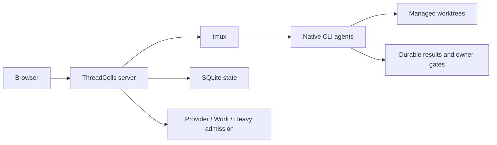

# ThreadCells

**Run multiple coding agents. Keep control of the machine and the result.**

ThreadCells is a self-hosted coding-agent operations console for a small fleet of native CLI coding agents. It keeps real tmux terminals, managed Git worktrees, writer and resource limits, durable completion evidence, and supervisor/reviewer workflows on one Linux host.

Public repository: [`IUnknown404I/threadcells`](https://github.com/IUnknown404I/threadcells)

*A 12-second isolated synthetic run through the real ThreadCells UI. No production state is shown.*

## In 20 seconds

Pick a project, start a supervisor, and let it delegate bounded work into managed worktrees. ThreadCells records the result and keeps capacity and owner decisions visible. It is for advanced solo developers and trusted small teams, not hostile multi-tenancy or an autonomous software factory.

## Why ThreadCells

- Native CLI agents remain in inspectable tmux terminals.
- Managed worktrees and writer authority reduce accidental collisions.
- Provider, Work, and Heavy capacity are admitted independently.
- Durable results and owner gates preserve operational truth.
- Optional installation-global Telegram alerts surface top-level completion, failure, and owner attention without project-specific wiring.
- Cleanup remains conservative: unknown state is not treated as dead.

Start with [What is ThreadCells?](docs/OVERVIEW.md), [Quick Setup](QUICK_SETUP.md), and [Your first project and agent](docs/FIRST_AGENT.md). The complete public guide covers [Installation](docs/INSTALLATION.md), [Core concepts](docs/CONCEPTS.md), [Telegram notifications](docs/TELEGRAM_NOTIFICATIONS.md), [Remote access](docs/REMOTE_ACCESS.md), [Security](SECURITY.md), and [Operations](docs/OPERATIONS.md). The in-product reader at `/docs` serves the same packaged allowlisted documentation corpus.

The [public website source](website/README.md) builds to static files for GitHub Pages or other static hosting. Provider and profile configuration live under `/settings/providers` and `/settings/profiles`; cleanup planning lives under `/settings/housekeeping`.

For a deliberately small first run, use the [safe starter example](examples/threadcells-starter/README.md). It gives a supervisor, developer, and reviewer a bounded documentation task; it does not ask agents to handle credentials, publish, or change services.

## Safety and preview status

The `0.1.0-alpha.1` technical preview supports a single Ubuntu/Debian Linux host, loopback-first access, and a Codex-first setup. Native agents can execute powerful commands; worktrees are not a security sandbox. See [limitations](docs/LIMITATIONS.md) before evaluation.

## FAQ

**Does ThreadCells publish or expose anything during setup?** No. The supported setup builds a local candidate, verifies it, and starts only a loopback listener when you run the server command.

**Does `threadcells doctor` change my machine?** No. It only reports whether the supported local prerequisites are present.

**Can I access the UI remotely?** Yes, while keeping ThreadCells loopback-only. Use an SSH tunnel for occasional access or, after explicit host-owner approval of the access boundary, an authenticated Caddy/Authelia HTTPS proxy. Never expose the raw ThreadCells port to the public Internet; see [Remote access](docs/REMOTE_ACCESS.md).

**Can I install the Web UI as an app?** Yes. The production UI includes a basic PWA manifest and conservative service worker. It remains network-dependent and never caches operational APIs, authorization, terminals, workflows, or Statistics.

**What should I review before distribution?** Treat the candidate manifest, checksums, SBOM, dependency review, branding provenance, security policy, and release evidence as review inputs—not publication approval.

## Maintainer

Created and maintained by [Subaev Ruslan](https://github.com/IUnknown404I), with contributions from the ThreadCells community.

## Provenance

ThreadCells is an independent, unofficial downstream of AWS Labs CLI Agent Orchestrator. It is not sponsored or endorsed by Amazon Web Services. Original upstream work is licensed under Apache License 2.0; see [NOTICE](NOTICE), [provenance](docs/PROVENANCE.md), and [changes from upstream](docs/CHANGES_FROM_UPSTREAM.md).
