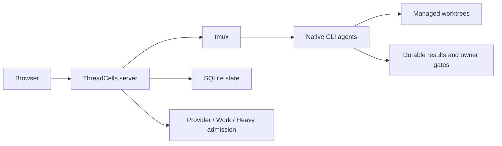

# ThreadCells

**Run coding agents as a system, not a pile of terminals.**

ThreadCells coordinates native CLI coding agents, keeps open workflows moving across model turns, and takes care of the orchestration environment underneath them. It watches host pressure, safely reclaims disposable ThreadCells runtime debris, and preserves active work and durable history on your own Linux host.

**[Website](https://iunknown404i.github.io/threadcells/)** ·
**[Documentation](https://iunknown404i.github.io/threadcells/docs/)** ·
**[GitHub](https://github.com/IUnknown404I/threadcells)** ·
**[Quick Setup](QUICK_SETUP.md)**

*The real release system at operational scale. Local paths, destinations, credentials, and private messages are excluded from public captures.*

## In 30 seconds

Create a session → choose an agent or supervisor → give it the job → watch the workflow → step in only when ThreadCells asks for an owner decision.

A supervisor can delegate to workers and reviewers, collect results through the Inbox, and continue the same logical mission across normal asynchronous and model-turn boundaries. You do not have to copy messages between terminals or treat a provider's final response as mission completion.

## Why ThreadCells

- Agents coordinate under durable supervisor workflows instead of relying on manual copy-and-paste.
- Native CLI agents remain in inspectable tmux terminals, with managed worktrees and explicit writer authority.
- Host pressure and independent capacity limits stay visible while protected-set-aware Housekeeping cleans eligible logs, caches, releases, and closed runtime debris.
- Active work, live state, recovery releases, backups, and durable session, workflow, Inbox, and result history are protected from routine cleanup.
- Durable results and explicit owner gates preserve operational truth across restarts and terminal retirement.
- Optional installation-global Telegram alerts surface top-level completion, failure, and owner attention without project-specific wiring.

ThreadCells actively keeps its own agent environment healthy; it cannot guarantee that the physical host, provider, or network will never fail. Unknown or ambiguous state is protected rather than guessed safe to delete.

| Durable multi-agent workflow | Protected Housekeeping |
| --- | --- |
|  |  |

Telegram notifications provide one low-noise, installation-global route for top-level completion, failure, and owner attention. Sensitive destination and credential fields are intentionally redacted in [the public Telegram capture](launch-media/output/screenshots/threadcells-telegram.png).

Start with [What is ThreadCells?](docs/OVERVIEW.md), [Quick Setup](QUICK_SETUP.md), and [Your first project and agent](docs/FIRST_AGENT.md). The complete public guide covers [Installation](docs/INSTALLATION.md), [Core concepts](docs/CONCEPTS.md), [Telegram notifications](docs/TELEGRAM_NOTIFICATIONS.md), [Remote access](docs/REMOTE_ACCESS.md), [Security](SECURITY.md), and [Operations](docs/OPERATIONS.md). The in-product reader at `/docs` serves the same packaged allowlisted documentation corpus.

The [public website source](website/README.md) builds to static files for GitHub Pages or other static hosting. Provider and profile configuration live under `/settings/providers` and `/settings/profiles`; cleanup planning lives under `/settings/housekeeping`.

For a deliberately small first run, use the [safe starter example](examples/threadcells-starter/README.md). It gives a supervisor, developer, and reviewer a bounded documentation task; it does not ask agents to handle credentials, publish, or change services.

## Safety and preview status

The `0.1.0-alpha.2` technical preview supports a single Ubuntu/Debian Linux host, loopback-first access, and a Codex-first setup. Native agents can execute powerful commands; worktrees are not a security sandbox. See [limitations](docs/LIMITATIONS.md) before evaluation.

The public `ghcr.io/iunknown404i/threadcells-release-bundle` OCI package carries verified release archives and evidence. It is a distribution artifact, not a Docker image or a supported container deployment mode; see the [release process](docs/RELEASE_PROCESS.md).

## FAQ

**Does ThreadCells publish or expose anything during setup?** No. The supported setup builds a local candidate, verifies it, and starts only a loopback listener when you run the server command.

**Does `threadcells doctor` change my machine?** No. It only reports whether the supported local prerequisites are present.

**Can I access the UI remotely?** Yes, while keeping ThreadCells loopback-only. Use an SSH tunnel for occasional access or, after explicit host-owner approval of the access boundary, an authenticated Caddy/Authelia HTTPS proxy. Never expose the raw ThreadCells port to the public Internet; see [Remote access](docs/REMOTE_ACCESS.md).

**Can I install the Web UI as an app?** Yes. The production UI includes a basic PWA manifest and conservative service worker. It remains network-dependent and never caches operational APIs, authorization, terminals, workflows, or Statistics.

**What should I review before distribution?** Treat the candidate manifest, checksums, SBOM, dependency review, branding provenance, security policy, and release evidence as review inputs—not publication approval.

## Issues & contributing

Use the curated [GitHub Issues](https://github.com/IUnknown404I/threadcells/issues) backlog for actionable public project work. Read [CONTRIBUTING.md](CONTRIBUTING.md) for the quick routes, [the canonical Issue policy](docs/ISSUES.md) for eligibility and triage, and [SECURITY.md](SECURITY.md) for private vulnerability reporting.

## Maintainer

Created and maintained by [Subaev Ruslan](https://github.com/IUnknown404I), with contributions from the ThreadCells community.

## Provenance

ThreadCells is an independent, unofficial downstream of AWS Labs CLI Agent Orchestrator. It is not sponsored or endorsed by Amazon Web Services. Original upstream work is licensed under Apache License 2.0; see [NOTICE](NOTICE), [provenance](docs/PROVENANCE.md), and [changes from upstream](docs/CHANGES_FROM_UPSTREAM.md).
