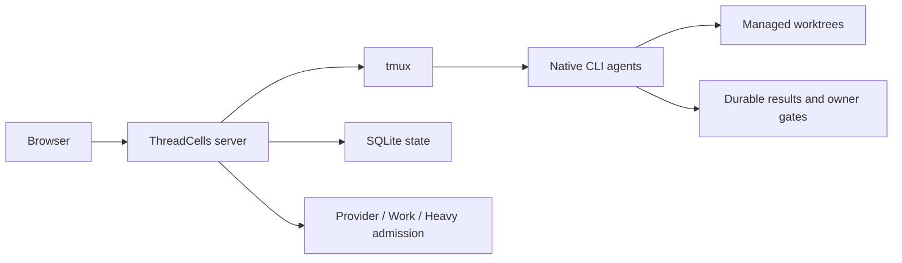

[English](../../README.md) · [Русский](../ru/README.md) · [简体中文](../zh-CN/README.md) · [Español](../es/README.md) · [Português (Brasil)](../pt-BR/README.md) · [Deutsch](../de/README.md) · **日本語**

# ThreadCells

**コーディングエージェントを、端末の寄せ集めではなく、一つのシステムとして動かす。**

ThreadCells はネイティブ CLI コーディングエージェントを協調させ、モデルターンをまたぐオープンなワークフローを進め続け、その下層にあるオーケストレーション環境を管理します。ホストの負荷を監視し、使い捨て可能な ThreadCells ランタイムの残骸を安全に回収しながら、自分の Linux ホスト上の進行中の作業と永続的な履歴を保護します。

**[Web サイト](https://iunknown404i.github.io/threadcells/ja/)** ·
**[ドキュメント](https://iunknown404i.github.io/threadcells/ja/docs/)** ·
**[GitHub](https://github.com/IUnknown404I/threadcells)** ·
**[クイックセットアップ](../../QUICK_SETUP.md)**

*運用規模で稼働する実際のリリースシステムです。ローカルパス、宛先、認証情報、非公開メッセージは公開用のキャプチャから除外しています。*

## 30 秒で分かること

セッションを作成 → エージェントまたはスーパーバイザーを選択 → 仕事を渡す → ワークフローを監視 → ThreadCells がオーナー判断を求めたときだけ介入します。

スーパーバイザーはワーカーやレビュアーに委任し、Inbox で結果を収集して、通常の非同期境界やモデルターン境界を越えて同じ論理的なミッションを継続できます。端末間でメッセージをコピーする必要も、プロバイダーの最終応答をミッション完了と見なす必要もありません。

## ThreadCells を使う理由

- エージェントは手作業のコピー＆ペーストではなく、永続的なスーパーバイザーワークフローの下で協調します。
- ネイティブ CLI エージェントは、管理された worktree と明示的な書き込み権限を備えた、確認可能な tmux 端末に留まります。
- ホスト負荷と独立した容量制限を可視化しつつ、保護対象セットを認識する Housekeeping が、対象となるログ、キャッシュ、リリース、終了済みランタイムの残骸をクリーンアップします。
- 進行中の作業、ライブ状態、リカバリーリリース、バックアップ、永続的なセッション、ワークフロー、Inbox、結果の履歴は通常のクリーンアップから保護されます。
- 永続的な結果と明示的なオーナーゲートにより、再起動や端末の退役をまたいで運用上の事実を保ちます。
- 任意のインストール全体向け Telegram アラートは、プロジェクト固有の配線なしで、最上位の完了、失敗、オーナーの注意を通知します。

ThreadCells は自身のエージェント環境を健全に保つよう積極的に動作しますが、物理ホスト、プロバイダー、ネットワークが決して故障しないとは保証できません。未知または曖昧な状態は、削除して安全だと推測せずに保護します。

| 永続的なマルチエージェントワークフロー | 保護された Housekeeping |
| --- | --- |
|  |  |

Telegram 通知は、最上位の完了、失敗、オーナーの注意に対して、ノイズの少ないインストール全体の経路を一つ提供します。機密性の高い宛先と認証情報のフィールドは、意図的に[公開 Telegram キャプチャ](../../launch-media/output/screenshots/threadcells-telegram.png)で編集されています。

[ThreadCells とは？](../OVERVIEW.md)、[クイックセットアップ](../../QUICK_SETUP.md)、[最初のプロジェクトとエージェント](../FIRST_AGENT.md)から始めてください。公開ガイド全体では、[インストール](../INSTALLATION.md)、[基本概念](../CONCEPTS.md)、[Telegram 通知](../TELEGRAM_NOTIFICATIONS.md)、[リモートアクセス](../REMOTE_ACCESS.md)、[セキュリティ](../../SECURITY.md)、[運用](../OPERATIONS.md)を扱います。プロダクト内の `/docs` リーダーは、同じパッケージ済みの許可リスト付きドキュメントコーパスを提供します。

[公開 Web サイトのソース](../../website/README.md)は GitHub Pages またはその他の静的ホスティング向けの静的ファイルをビルドします。プロバイダーとプロファイルの設定は `/settings/providers` と `/settings/profiles` にあり、クリーンアップ計画は `/settings/housekeeping` にあります。

意図的に小さく始めるには、[安全なスターター例](../../examples/threadcells-starter/README.md)を使ってください。スーパーバイザー、開発者、レビュアーに限定したドキュメント作業を与え、エージェントに認証情報の取り扱い、公開、サービス変更を求めません。

## 安全性とプレビューの状態

`0.3.3-alpha` 技術プレビューは、単一の Ubuntu/Debian Linux ホスト、ループバック優先のアクセス、Codex を中心としたセットアップをサポートします。ネイティブエージェントは強力なコマンドを実行できます。worktree はセキュリティサンドボックスではありません。評価前に[制限事項](../LIMITATIONS.md)を確認してください。

公開の `ghcr.io/iunknown404i/threadcells-release-bundle` OCI パッケージには、検証済みのリリースアーカイブと証跡が含まれます。これは配布成果物であり、Docker イメージやサポート対象のコンテナデプロイモードではありません。[リリースプロセス](../RELEASE_PROCESS.md)を参照してください。

## FAQ

**セットアップ中に ThreadCells が何かを公開または外部公開しますか？** いいえ。サポート対象のセットアップはローカル候補をビルドして検証し、サーバーコマンドを実行したときだけループバックリスナーを起動します。

**`threadcells doctor` はマシンを変更しますか？** いいえ。サポート対象のローカル前提条件が存在するかどうかを報告するだけです。

**UI にリモートアクセスできますか？** はい。ThreadCells をループバック専用のままにできます。ときどきのアクセスには SSH トンネルを使うか、アクセス境界についてホスト所有者が明示的に承認した後で、認証済み Caddy/Authelia HTTPS プロキシを使います。生の ThreadCells ポートを公衆インターネットへ公開してはいけません。[リモートアクセス](../REMOTE_ACCESS.md)を参照してください。

**Web UI をアプリとしてインストールできますか？** はい。プロダクション UI には基本的な PWA マニフェストと控えめな service worker が含まれます。ネットワークに依存し続け、運用 API、認可、端末、ワークフロー、Statistics をキャッシュしません。

**配布前に何をレビューすべきですか？** 候補マニフェスト、チェックサム、SBOM、依存関係レビュー、ブランディングの来歴、セキュリティポリシー、リリース証跡は、公開承認ではなくレビュー入力として扱ってください。

## Issue と貢献

質問、初期アイデア、コミュニティのセットアップには [GitHub Discussions](https://github.com/IUnknown404I/threadcells/discussions) を使ってください。確認済みで実行可能な公開プロジェクト作業には、整理された [GitHub Issues](https://github.com/IUnknown404I/threadcells/issues) バックログを使います。迅速な経路は [CONTRIBUTING.md](../../CONTRIBUTING.md)、適格性とトリアージは[正規の Issue ポリシー](../ISSUES.md)、脆弱性の非公開報告は [SECURITY.md](../../SECURITY.md)を読んでください。

## メンテナー

ThreadCells は [Subaev Ruslan](https://github.com/IUnknown404I) が作成・保守しており、ThreadCells コミュニティからの貢献を受けています。

## 来歴

ThreadCells は AWS Labs CLI Agent Orchestrator の独立した非公式 downstream です。Amazon Web Services の後援または支持を受けていません。オリジナルの上流プロジェクトは Apache License 2.0 でライセンスされています。[NOTICE](../../NOTICE)、[来歴](../PROVENANCE.md)、[上流からの変更](../CHANGES_FROM_UPSTREAM.md)を参照してください。
