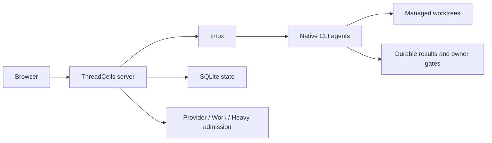

[English](../../README.md) · [Русский](../ru/README.md) · [简体中文](../zh-CN/README.md) · [Español](../es/README.md) · **Português (Brasil)** · [Deutsch](../de/README.md) · [日本語](../ja/README.md)

# ThreadCells

**Execute agentes de programação como um sistema, não como um amontoado de terminais.**

O ThreadCells coordena agentes de programação CLI nativos, mantém fluxos de trabalho abertos em andamento entre turnos do modelo e cuida do ambiente de orquestração que os sustenta. Ele monitora a pressão do host, recupera com segurança resíduos descartáveis do runtime do ThreadCells e preserva o trabalho ativo e o histórico durável no seu próprio host Linux.

**[Site](https://iunknown404i.github.io/threadcells/pt-BR/)** ·
**[Documentação](https://iunknown404i.github.io/threadcells/pt-BR/docs/)** ·
**[GitHub](https://github.com/IUnknown404I/threadcells)** ·
**[Configuração rápida](../../QUICK_SETUP.md)**

*O sistema de lançamento real em escala operacional. Caminhos locais, destinos, credenciais e mensagens privadas são excluídos das capturas públicas.*

## Em 30 segundos

Crie uma sessão → escolha um agente ou supervisor → atribua o trabalho → acompanhe o fluxo de trabalho → intervenha apenas quando o ThreadCells solicitar uma decisão do proprietário.

Um supervisor pode delegar a executores e revisores, coletar resultados pelo Inbox e continuar a mesma missão lógica através dos limites assíncronos normais e dos turnos do modelo. Você não precisa copiar mensagens entre terminais nem interpretar a resposta final de um provedor como conclusão da missão.

## Por que usar o ThreadCells

- Os agentes se coordenam por fluxos de trabalho duráveis do supervisor, sem depender de copiar e colar manualmente.
- Agentes CLI nativos permanecem em terminais `tmux` inspecionáveis, com worktrees gerenciados e autoridade explícita de escrita.
- A pressão do host e limites independentes de capacidade continuam visíveis, enquanto o Housekeeping, ciente do conjunto protegido, limpa logs, caches, lançamentos e resíduos fechados elegíveis do runtime.
- Trabalho ativo, estado ao vivo, lançamentos de recuperação, backups e o histórico durável de sessões, fluxos de trabalho, Inbox e resultados ficam protegidos da limpeza rotineira.
- Resultados duráveis e owner gates explícitos preservam a verdade operacional entre reinicializações e aposentadorias de terminais.
- Alertas globais opcionais do Telegram informam conclusão, falha e atenção do proprietário no nível superior, sem configuração por projeto.

O ThreadCells mantém ativamente a saúde do próprio ambiente de agentes, mas não pode garantir que o host físico, o provedor ou a rede jamais falhem. Um estado desconhecido ou ambíguo é protegido, em vez de ser presumido seguro para exclusão.

| Fluxo de trabalho durável com vários agentes | Housekeeping protegido |
| --- | --- |
|  |  |

As notificações do Telegram oferecem uma única rota global e de baixo ruído para conclusão, falha e atenção do proprietário no nível superior. Os campos sensíveis de destino e credenciais são intencionalmente ocultados na [captura pública do Telegram](../../launch-media/output/screenshots/threadcells-telegram.png).

Comece por [O que é o ThreadCells?](../OVERVIEW.md), [Configuração rápida](../../QUICK_SETUP.md) e [Seu primeiro projeto e agente](../FIRST_AGENT.md). O guia público completo abrange [Instalação](../INSTALLATION.md), [Conceitos centrais](../CONCEPTS.md), [Notificações do Telegram](../TELEGRAM_NOTIFICATIONS.md), [Acesso remoto](../REMOTE_ACCESS.md), [Segurança](../../SECURITY.md) e [Operações](../OPERATIONS.md). O leitor integrado em `/docs` serve o mesmo corpus de documentação empacotado e selecionado por allowlist.

O [código-fonte do site público](../../website/README.md) é compilado em arquivos estáticos para o GitHub Pages ou outra hospedagem estática. As configurações de provedores e perfis ficam em `/settings/providers` e `/settings/profiles`; o planejamento de limpeza fica em `/settings/housekeeping`.

Para uma primeira execução deliberadamente pequena, use o [exemplo inicial seguro](../../examples/threadcells-starter/README.md). Ele atribui a um supervisor, desenvolvedor e revisor uma tarefa de documentação delimitada; não pede que os agentes manipulem credenciais, publiquem ou alterem serviços.

## Segurança e status da versão de prévia

A prévia técnica `0.3.4-alpha` oferece suporte a um único host Linux Ubuntu/Debian, acesso por loopback como padrão e uma configuração voltada primeiro ao Codex. Agentes nativos podem executar comandos poderosos; worktrees não são um sandbox de segurança. Consulte as [limitações](../LIMITATIONS.md) antes de avaliar.

O pacote OCI público `ghcr.io/iunknown404i/threadcells-release-bundle` contém arquivos de lançamento verificados e suas evidências. Ele é um artefato de distribuição, não uma imagem Docker nem um modo de implantação em contêiner compatível; consulte o [processo de lançamento](../RELEASE_PROCESS.md).

## Perguntas frequentes

**O ThreadCells publica ou expõe algo durante a configuração?** Não. O procedimento compatível cria um candidato local, verifica-o e inicia apenas um listener de loopback quando você executa o comando do servidor.

**`threadcells doctor` altera a minha máquina?** Não. Ele apenas informa se os pré-requisitos locais compatíveis estão presentes.

**Posso acessar a UI remotamente?** Sim, mantendo o ThreadCells somente em loopback. Use um túnel SSH para acesso ocasional ou, após aprovação explícita do proprietário do host para esse limite de acesso, um proxy HTTPS autenticado com Caddy/Authelia. Nunca exponha a porta desprotegida do ThreadCells à Internet pública; consulte [Acesso remoto](../REMOTE_ACCESS.md).

**Posso instalar a Web UI como um aplicativo?** Sim. A UI de produção inclui um manifest PWA básico e um service worker conservador. Ela continua dependente da rede e nunca armazena em cache APIs operacionais, autorização, terminais, fluxos de trabalho ou Statistics.

**O que devo revisar antes da distribuição?** Considere o manifest do candidato, checksums, SBOM, revisão de dependências, procedência da marca, política de segurança e evidências de lançamento como insumos de revisão, não como autorização para publicar.

## Issues e contribuições

Use as [GitHub Discussions](https://github.com/IUnknown404I/threadcells/discussions) para perguntas, ideias iniciais e configurações da comunidade. Use o backlog selecionado de [GitHub Issues](https://github.com/IUnknown404I/threadcells/issues) para trabalho público confirmado e executável. Leia [CONTRIBUTING.md](../../CONTRIBUTING.md) para os caminhos rápidos, [a política canônica de Issues](../ISSUES.md) para elegibilidade e triagem, e [SECURITY.md](../../SECURITY.md) para relatar vulnerabilidades de modo privado.

## Manutenção

Criado e mantido por [Subaev Ruslan](https://github.com/IUnknown404I), com contribuições da comunidade ThreadCells.

## Procedência

O ThreadCells é um downstream independente e não oficial do AWS Labs CLI Agent Orchestrator. Ele não é patrocinado nem endossado pela Amazon Web Services. O trabalho original é licenciado sob a Apache License 2.0; consulte [NOTICE](../../NOTICE), a [procedência](../PROVENANCE.md) e as [mudanças em relação ao upstream](../CHANGES_FROM_UPSTREAM.md).
