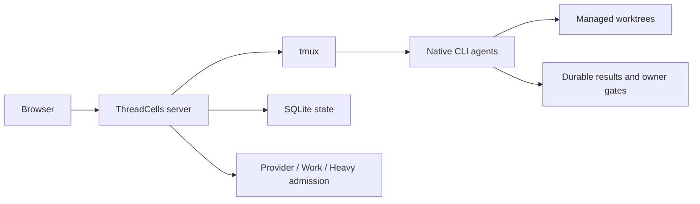

[English](../../README.md) · **Русский** · [简体中文](../zh-CN/README.md) · [Español](../es/README.md) · [Português (Brasil)](../pt-BR/README.md) · [Deutsch](../de/README.md) · [日本語](../ja/README.md)

# ThreadCells

**Запускайте агентов программирования как систему, а не как набор терминалов.**

ThreadCells координирует нативных CLI-агентов программирования, продолжает открытые рабочие процессы между ответами модели и обслуживает их среду оркестрации. Он следит за нагрузкой на хост, безопасно удаляет одноразовые артефакты среды исполнения ThreadCells и сохраняет активную работу и долговременную историю на вашем Linux-хосте.

**[Сайт](https://iunknown404i.github.io/threadcells/ru/)** ·
**[Документация](https://iunknown404i.github.io/threadcells/ru/docs/)** ·
**[GitHub](https://github.com/IUnknown404I/threadcells)** ·
**[Быстрая настройка](../../QUICK_SETUP.md)**

*Реальная релизная система при рабочей нагрузке. Локальные пути, адреса назначения, учётные данные и личные сообщения исключены из публичных снимков.*

## За 30 секунд

Создайте сессию → выберите агента или координатора → поставьте задачу → наблюдайте за рабочим процессом → вмешивайтесь только тогда, когда ThreadCells запрашивает решение владельца.

Координатор может делегировать работу исполнителям и проверяющим, собирать результаты через Inbox и продолжать одну логическую задачу через обычные асинхронные границы и ответы модели. Вам не придётся вручную переносить сообщения между терминалами или считать финальный ответ провайдера завершением задачи.

## Зачем нужен ThreadCells

- Агенты координируются внутри долговременных рабочих процессов, а не с помощью ручного копирования сообщений.
- Нативные CLI-агенты остаются в доступных для проверки терминалах tmux, используют управляемые worktree и явные полномочия на запись.
- Нагрузка на хост и независимые ограничения ёмкости остаются видимыми, а Обслуживание с учётом защищённого множества очищает подходящие логи, кэши, релизы и закрытые артефакты среды исполнения.
- Активная работа, текущее состояние, релизы восстановления, резервные копии и долговременная история сессий, рабочих процессов, Inbox и результатов защищены от плановой очистки.
- Сохраняемые результаты и явные owner gates поддерживают достоверное операционное состояние после перезапусков и завершения терминалов.
- Необязательные общие для всей установки уведомления Telegram сообщают о завершении и сбое верхнеуровневых задач или необходимости вмешательства владельца без привязки к конкретному проекту.

ThreadCells активно поддерживает здоровье собственной агентской среды, но не может гарантировать, что физический хост, провайдер или сеть никогда не откажут. Неизвестное или неоднозначное состояние защищается, а не признаётся безопасным для удаления по догадке.

| Долговременный рабочий процесс с несколькими агентами | Защищённое обслуживание |
| --- | --- |
|  |  |

Уведомления Telegram предоставляют один общий для установки и ненавязчивый канал для сообщений о завершении и сбое верхнеуровневых задач или необходимости вмешательства владельца. Чувствительные поля адресата и учётных данных намеренно скрыты на [публичном снимке Telegram](../../launch-media/output/screenshots/threadcells-telegram.png).

Начните с разделов [Что такое ThreadCells?](../OVERVIEW.md), [Быстрая настройка](../../QUICK_SETUP.md) и [Ваш первый проект и агент](../FIRST_AGENT.md). Полное публичное руководство охватывает [установку](../INSTALLATION.md), [основные понятия](../CONCEPTS.md), [уведомления Telegram](../TELEGRAM_NOTIFICATIONS.md), [удалённый доступ](../REMOTE_ACCESS.md), [безопасность](../../SECURITY.md) и [эксплуатацию](../OPERATIONS.md). Встроенный просмотрщик по адресу `/docs` использует тот же упакованный корпус документации из allowlist.

[Исходный код публичного сайта](../../website/README.md) собирается в статические файлы для GitHub Pages или другого статического хостинга. Настройки провайдеров и профилей находятся в `/settings/providers` и `/settings/profiles`, а планирование очистки — в `/settings/housekeeping`.

Для намеренно небольшого первого запуска используйте [безопасный стартовый пример](../../examples/threadcells-starter/README.md). Он даёт координатору, исполнителю и проверяющему ограниченную задачу по документации и не просит агентов работать с учётными данными, публиковать что-либо или менять службы.

## Безопасность и статус предварительной версии

Техническая предварительная версия `0.3.3-alpha` поддерживает один хост Ubuntu/Debian Linux, доступ через loopback по умолчанию и настройку прежде всего для Codex. Нативные агенты могут выполнять мощные команды; worktree не являются песочницей безопасности. Перед оценкой продукта прочитайте [ограничения](../LIMITATIONS.md).

Публичный OCI-пакет `ghcr.io/iunknown404i/threadcells-release-bundle` содержит проверенные архивы релиза и подтверждающие материалы. Это дистрибутивный артефакт, а не Docker-образ и не поддерживаемый способ контейнерного развёртывания; см. [процесс выпуска](../RELEASE_PROCESS.md).

## Частые вопросы

**Публикует ли ThreadCells что-либо или открывает ли внешний доступ во время настройки?** Нет. Поддерживаемая настройка собирает локальный кандидат, проверяет его и запускает listener только на loopback после выполнения команды сервера.

**Изменяет ли `threadcells doctor` мою машину?** Нет. Команда только сообщает, установлены ли поддерживаемые локальные предварительные требования.

**Можно ли открыть UI удалённо?** Да, оставив ThreadCells доступным только через loopback. Для эпизодического доступа используйте SSH-туннель, а после явного одобрения границы доступа владельцем хоста — аутентифицированный HTTPS-прокси Caddy/Authelia. Никогда не открывайте необработанный порт ThreadCells в публичный Интернет; см. [Удалённый доступ](../REMOTE_ACCESS.md).

**Можно ли установить Web UI как приложение?** Да. Производственный UI содержит базовый PWA manifest и консервативный service worker. Он по-прежнему зависит от сети и никогда не кэширует операционные API, авторизацию, терминалы, рабочие процессы или Statistics.

**Что проверить перед распространением?** Рассматривайте manifest и контрольные суммы кандидата, SBOM, проверку зависимостей, происхождение бренда, политику безопасности и релизные свидетельства как материалы для проверки, а не как разрешение на публикацию.

## Issues и участие в разработке

Используйте [GitHub Discussions](https://github.com/IUnknown404I/threadcells/discussions) для вопросов, ранних идей и описаний пользовательских конфигураций. Ведите подтверждённую и пригодную к исполнению публичную работу в курируемом списке [GitHub Issues](https://github.com/IUnknown404I/threadcells/issues). Прочитайте [CONTRIBUTING.md](../../CONTRIBUTING.md) о быстрых способах участия, [каноническую политику Issues](../ISSUES.md) о критериях и triage и [SECURITY.md](../../SECURITY.md) о конфиденциальном сообщении об уязвимостях.

## Сопровождение

Проект создал и сопровождает [Subaev Ruslan](https://github.com/IUnknown404I) при участии сообщества ThreadCells.

## Происхождение

ThreadCells — независимый неофициальный downstream проекта AWS Labs CLI Agent Orchestrator. AWS не спонсирует и не участвует в нём. Оригинальный upstream лицензирован по Apache License 2.0; см. [NOTICE](../../NOTICE), [происхождение проекта](../PROVENANCE.md) и [изменения относительно upstream](../CHANGES_FROM_UPSTREAM.md).
