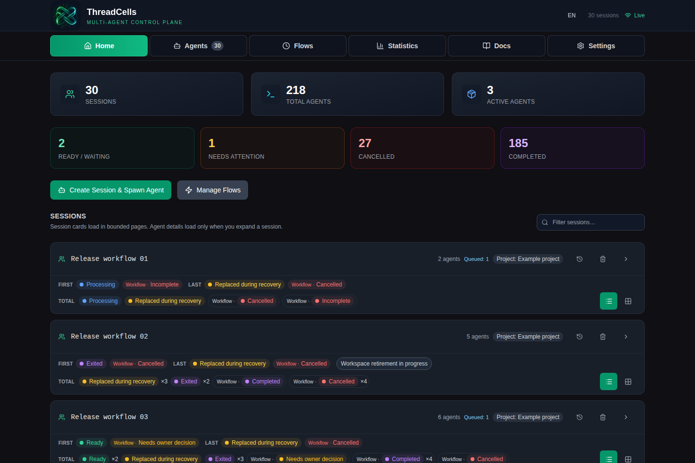
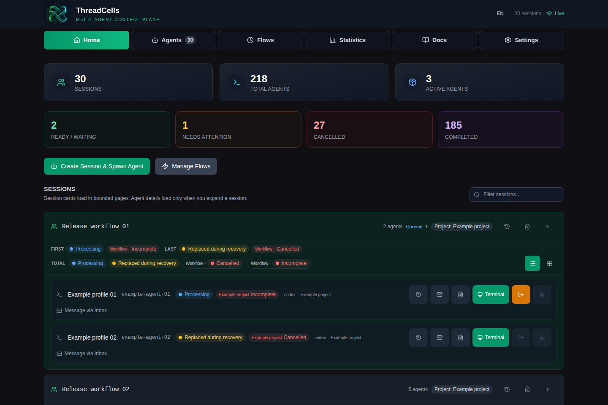
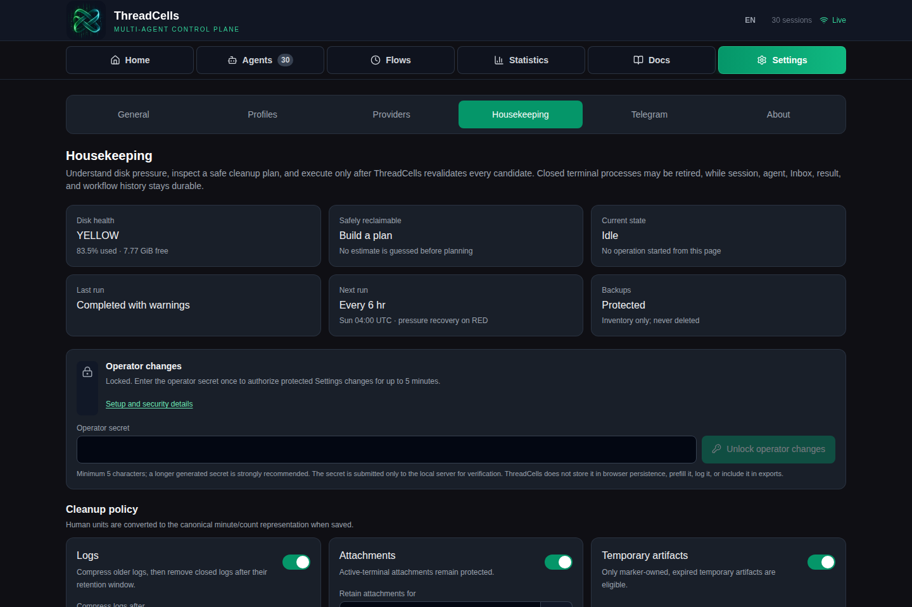
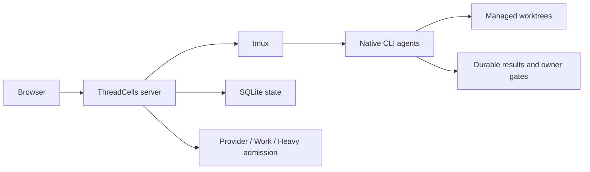

[English](../../README.md) · [Русский](../ru/README.md) · **简体中文** · [Español](../es/README.md) · [Português (Brasil)](../pt-BR/README.md) · [Deutsch](../de/README.md) · [日本語](../ja/README.md)

# ThreadCells

**把编程智能体作为一个系统运行，而不是堆放一组终端。**

ThreadCells 协调原生 CLI 编程智能体，让开放的工作流跨模型轮次持续推进，并维护支撑它们的编排环境。它会监控主机压力，安全回收可丢弃的 ThreadCells 运行时残留，同时在您自己的 Linux 主机上保护活跃工作和持久历史。

**[网站](https://iunknown404i.github.io/threadcells/zh-CN/)** ·
**[文档](https://iunknown404i.github.io/threadcells/zh-CN/docs/)** ·
**[GitHub](https://github.com/IUnknown404I/threadcells)** ·
**[快速设置](../../QUICK_SETUP.md)**

*处于实际运维规模的真实发布系统。公开截图已排除本地路径、目标地址、凭据和私密消息。*

## 30 秒了解 ThreadCells

创建会话 → 选择智能体或协调者 → 交付任务 → 观察工作流 → 仅在 ThreadCells 请求所有者决策时介入。

协调者可以把任务委派给执行者和审查者，通过 Inbox 收集结果，并让同一项逻辑任务跨越常规异步边界和模型轮次继续执行。您无需在终端之间手工复制消息，也无需把提供商的一次最终响应误当作整个任务已经完成。

## 为什么选择 ThreadCells

- 智能体在持久化的协调者工作流中协作，无需依赖手工复制粘贴。
- 原生 CLI 智能体保留在可检查的 tmux 终端中，并使用托管 worktree 和明确的写入权限。
- 主机压力和彼此独立的容量限制始终可见；理解受保护集合的 Housekeeping 只会清理符合条件的日志、缓存、发布版本和已关闭的运行时残留。
- 活跃工作、实时状态、恢复版本、备份，以及持久化的会话、工作流、Inbox 和结果历史，都不会被常规清理误删。
- 持久化结果和明确的 owner gate 可在重启及终端退役后继续保留真实的运维状态。
- 可选的全局 Telegram 通知无需项目级接线，即可报告顶层完成、失败和需要所有者关注的情况。

ThreadCells 会主动维护自身智能体环境的健康状态，但无法保证物理主机、提供商或网络永不故障。遇到未知或含糊状态时，系统会予以保护，而不会猜测其可安全删除。

| 持久化的多智能体工作流 | 受保护的 Housekeeping |
| --- | --- |
|  |  |

Telegram 通知为顶层完成、失败和需要所有者关注的情况提供一个低干扰、全安装共用的通道。[公开的 Telegram 截图](../../launch-media/output/screenshots/threadcells-telegram.png)已特意隐去敏感的目标地址和凭据字段。

请从[什么是 ThreadCells？](../OVERVIEW.md)、[快速设置](../../QUICK_SETUP.md)和[您的第一个项目与智能体](../FIRST_AGENT.md)开始。完整公开指南涵盖[安装](../INSTALLATION.md)、[核心概念](../CONCEPTS.md)、[Telegram 通知](../TELEGRAM_NOTIFICATIONS.md)、[远程访问](../REMOTE_ACCESS.md)、[安全](../../SECURITY.md)和[运维](../OPERATIONS.md)。产品内的 `/docs` 阅读器提供同一套经过 allowlist 筛选并打包的文档语料。

[公开网站源码](../../website/README.md)可构建为 GitHub Pages 或其他静态托管服务使用的静态文件。提供商和配置文件位于 `/settings/providers` 与 `/settings/profiles`；清理规划位于 `/settings/housekeeping`。

若要进行一个刻意保持简短的首次运行，请使用[安全入门示例](../../examples/threadcells-starter/README.md)。它为协调者、开发者和审查者提供一项范围受限的文档任务，不会要求智能体处理凭据、执行发布或更改服务。

## 安全与预览版本状态

`0.3.0-alpha.3` 技术预览版支持单台 Ubuntu/Debian Linux 主机，默认采用 loopback 访问，并以 Codex 为首要配置。原生智能体可以执行高权限命令；worktree 不是安全沙箱。评估前请阅读[当前限制](../LIMITATIONS.md)。

公开 OCI 包 `ghcr.io/iunknown404i/threadcells-release-bundle` 携带经过验证的发布归档和证据。它是分发制品，不是 Docker 镜像，也不是受支持的容器部署方式；请参阅[发布流程](../RELEASE_PROCESS.md)。

## 常见问题

**ThreadCells 会在设置过程中发布或暴露任何内容吗？** 不会。受支持的设置流程会构建并验证本地候选版本；只有在您运行服务器命令时，才会启动仅监听 loopback 的服务。

**`threadcells doctor` 会修改我的机器吗？** 不会。它只会报告本地环境是否具备受支持的先决条件。

**我能远程访问 UI 吗？** 可以，同时仍让 ThreadCells 仅监听 loopback。偶尔访问时使用 SSH 隧道；在主机所有者明确批准访问边界后，也可以使用带身份验证的 Caddy/Authelia HTTPS 反向代理。切勿把原始 ThreadCells 端口暴露到公共互联网；请参阅[远程访问](../REMOTE_ACCESS.md)。

**我能把 Web UI 安装成应用吗？** 可以。生产 UI 包含基础 PWA manifest 和保守的 service worker。它仍然依赖网络，绝不会缓存运维 API、授权、终端、工作流或 Statistics。

**分发前应检查什么？** 应把候选版本的 manifest、校验和、SBOM、依赖审查、品牌来源、安全策略和发布证据作为审查输入，而不是发布许可。

## Issue 与贡献

请通过 [GitHub Discussions](https://github.com/IUnknown404I/threadcells/discussions)提出问题、早期想法并分享社区配置。已确认、可执行的公开项目工作应进入经过筛选的 [GitHub Issues](https://github.com/IUnknown404I/threadcells/issues) backlog。请阅读 [CONTRIBUTING.md](../../CONTRIBUTING.md) 了解快速参与方式，阅读[规范 Issue 策略](../ISSUES.md)了解准入与分流规则，并通过 [SECURITY.md](../../SECURITY.md) 私下报告漏洞。

## 维护者

由 [Subaev Ruslan](https://github.com/IUnknown404I) 创建并维护，ThreadCells 社区亦有贡献。

## 来源

ThreadCells 是 AWS Labs CLI Agent Orchestrator 的独立、非官方下游项目。Amazon Web Services 不赞助也不认可本项目。原始上游项目采用 Apache License 2.0；请参阅 [NOTICE](../../NOTICE)、[项目来源](../PROVENANCE.md)和[相较上游的变更](../CHANGES_FROM_UPSTREAM.md)。
